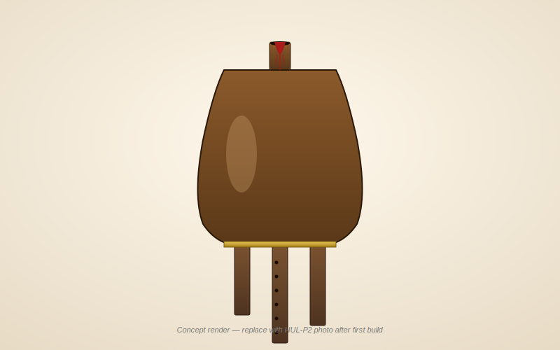

# Hulusi (葫芦丝) — Wooden Cucurbit Free-Reed Flute Family

> *Engineering documentation for a 5-key family (B♭ / C / D / F / G) of wooden hulusi, built on the v4.1 instrument-maker scaffold. Stopped-pipe + free-reed acoustic model, parametric workbook with 33 named globals, SolidWorks design-table parity, dimensioned per-family-member drawings, prototype ladder, and recruiter-facing build-log site.*


*Concept render — replace with photo of first HUL-P2 (F-key) prototype after final acoustic tuning. Manufacturing dimensions come from the parametric design table, not from this image.*

## What this is

Engineering documentation for a five-key family of wooden hulusi, the Chinese cucurbit free-reed flute. The repo ships:

1. **A parametric design table** ([`hulusi-design-table.xlsx`](hulusi-design-table.xlsx)) — `Master_Inputs` sheet with 33 named global variables driving six derived sheets (`Acoustics`, `Pipes`, `Holes`, `Family`, `BOM`, `Validation`). Every input is blue (#0000FF font + #D6E4F0 fill); every other cell is a formula. The named-globals scheme matches the SolidWorks global-variable list in [`cad/hulusi-design-table.txt`](cad/hulusi-design-table.txt) **exactly** so the SW design-table link is bidirectional.
2. **A complete v4 build packet** — [`design.md`](design.md), [`bom.csv`](bom.csv), [`sourcing.csv`](sourcing.csv), [`cut-list.csv`](cut-list.csv), [`validation.csv`](validation.csv), [`assembly-manual.md`](assembly-manual.md), [`supplier-rfq.md`](supplier-rfq.md), [`drawing-brief.md`](drawing-brief.md), [`visual-bom-brief.md`](visual-bom-brief.md), [`wolfram-starter.wl`](wolfram-starter.wl), [`risks.md`](risks.md), [`photo-shotlist.md`](photo-shotlist.md), [`family-spec.csv`](family-spec.csv).
3. **Per-family-member dimensioned drawings** — `drawings/hulusi-Bb.svg`, `hulusi-C.svg`, `hulusi-D.svg`, `hulusi-F.svg`, `hulusi-G.svg`, plus the centerline section, family-scale comparison, and the 4× reed-slot detail.
4. **Recruiter-facing artifacts** — auto-generated [`capstone-deck.pptx`](capstone-deck.pptx), printable [`print-packet.pdf`](print-packet.pdf), and a self-contained build-log static site under [`site/`](site/index.html).
5. **Studio explorer** — [`explorer.html`](explorer.html) collects the packet, design files, validation scaffold, Wolfram starter, CAD/OpenSCAD notes, print packet, and build-log site into a single review surface.

Sister repos: [`udu`](https://github.com/tonykoop/udu) (the v4 reference scaffold this repo upgrades from), [`gemshorn`](https://github.com/tonykoop/gemshorn), [`ocarina`](https://github.com/tonykoop/ocarina), [`transverse-flute`](https://github.com/tonykoop/transverse-flute), [`tongue-drum`](https://github.com/tonykoop/tongue-drum), [`instrument-maker`](https://github.com/tonykoop/instrument-maker).

## What's new in v4.1 (vs. the v4 udu scaffold)

| v4 (udu) | v4.1 (hulusi) |
|---|---|
| Single workbook sheet | 7 sheets: `Master_Inputs` + `Acoustics` + `Pipes` + `Holes` + `Family` + `BOM` + `Validation` |
| Zero named ranges | **33 named globals** — SW design-table link is one-click |
| Family table was hand-typed static values | Family sheet recomputes all 5 keys live from `Master_Inputs` |
| No data-validation dropdowns | Dropdowns for key, gourd species, tube wood, reed material |
| No cents-error column | `cents_error` formula auto-fills when measured Hz is entered |
| Single shrinkage correction | `pull_down_cents` (per-reed) + `correction_pct` (global pipe scale) |
| One generic family-scale SVG | One dimensioned SVG per key (B♭, C, D, F, G) |
| No risks.md | Full red-team output with 5 risk categories × verification tests |
| No build-log site | `site/index.html` recruiter-grade static page |

## Background — what makes the hulusi different

The hulusi (葫芦丝, *húlúsī*, "gourd silk") is a Chinese free-reed wind instrument: a dried bottle gourd serving as a wind chest, with three pipes inserted into its base. Each pipe carries a brass free reed at its top end. The center pipe has 7 finger holes and plays melody; the two outer pipes are drones — one fixed at a fifth above the tonic, one waxable so the player can mute or unmute it mid-phrase.

This build replaces the dried gourd with a lathe-turned hardwood gourd and the bamboo with pakkawood, for repeatability and bench durability — but the cultural lineage and naming remain credited.

The governing model is **three independent stopped-pipe + free-reed systems sharing a wind chest**:

```text
f_pipe = c / (4 · L_eff)        with  L_eff = L_acoustic + 0.6·r_bore
f_reed = K · t / L_tongue²      (cantilever; brass K ≈ 27,300 imperial)
```

Each reed is **cut sharp** by `pull_down_cents` (default −30 ¢). The pipe then pulls the reed down to its own resonance — classic free-reed pull-down. The empirical correction loop in `Master_Inputs` and `validation.csv` captures the actual pull-down per build, so the next instrument's reeds can be cut closer to target.

See [`design.md`](design.md) and [`wolfram-starter.wl`](wolfram-starter.wl) for the full physics treatment, including a 2-mode coupling-matrix placeholder ready to fit against measured HUL-P0 data.

## Family targets

The first prototype is the **F-key** standard (modern factory voicing, all-holes-closed = F4 = 349 Hz). Once F-key voicing is stable, the same parametric model drives B♭ / C / D / G — see [`family-spec.csv`](family-spec.csv) and the `Family` sheet in the workbook.

| Model | Key | All-closed note | Mel L | Dr1 (5th) L | Dr2 (oct) L | Reed L mel | Use |
|---|---|---|---:|---:|---:|---:|---|
| **HUL-B♭** | B♭ | F3 (175 Hz) | 14.89 in | 10.05 in | 7.62 in | 0.98 in | Low / warm voice |
| **HUL-C**  | C  | G3 (196 Hz) | 13.30 in |  8.99 in | 6.82 in | 0.92 in | Vocal range |
| **HUL-D**  | D  | A3 (220 Hz) | 11.89 in |  8.05 in | 6.12 in | 0.87 in | Folk / dance |
| **HUL-F** *(prototype 1)* | F | C4 (262 Hz)\* | 10.05 in | 6.82 in | 5.20 in | 0.80 in | **Standard** |
| **HUL-G**  | G  | D4 (294 Hz) |  8.99 in |  6.12 in | 4.67 in | 0.75 in | Bright / festive |

\* Modern Western convention. Traditional Dai voicing puts all-closed at sol (one fifth below). Both reachable from the same workbook by swapping `key_midi`.

## Prototype ladder

| Prototype | Goal | Success criteria |
|---|---|---|
| **HUL-P0** reed coupon | Validate brass-shim cutting + slot fit | Reed sounds cleanly at predicted f ±50 ¢; 3 consistent cuts |
| **HUL-P1** single melody pipe | Validate stopped-pipe + finger-hole layout | All 7 hole notes within ±25 ¢ after wax tuning |
| **HUL-P2** full F-key hulusi | Hit family target | Tonic + 5th + oct drones in tune; air seals at gourd joints |
| **HUL-P3** waxable Drone 2 | Implement removable-wax drone control | Player can mute/unmute mid-phrase |
| **HUL-P4** family molds/jigs | Scale to B♭ / C / D / G | Predictable pitch trend; reed-cut jig usable for all 5 keys |

## Hardware alignment — ShopBot + lathe + Epilog laser

The build chain is fully tooled at Maker Nexus + home shop:

1. `Master_Inputs` cells → SolidWorks global vars via design-table link.
2. SW parametric model regenerates pipes, gourd, reed slots for the selected key.
3. ShopBot CNC routes pakkawood tube blanks to length and bores them; lathe turns walnut gourd halves; Epilog laser cuts brass-shim reeds and frame plates.
4. Hand finish: reed file-tuning, finger-hole bevels, beeswax-rosin seal at gourd-pipe joints.
5. Validate against [`validation.csv`](validation.csv); fold cents-error back into `correction_pct` so the next instrument prints correct.

## Repository structure

```text
hulusi/
├── README.md                       ← you are here
├── LICENSE                         ← MIT
├── .gitignore
│
├── design.md                       ← stopped-pipe + free-reed model, prototype ladder
├── hulusi-design-table.xlsx        ← parametric workbook (Master_Inputs + 6 derived sheets)
├── family-spec.csv                 ← per-key spec rows driving family generation
│
├── bom.csv                         ← bill of materials (15 lines)
├── sourcing.csv                    ← supplier/search tracker
├── cut-list.csv                    ← rough/finished dimensions, tolerances, family scaling
├── validation.csv                  ← target/measured tuning + cents-error log
├── supplier-rfq.md                 ← RFQ template
│
├── assembly-manual.md              ← shop-floor build sequence (14 steps)
├── drawing-brief.md                ← required CAD views + critical dimensions
├── visual-bom-brief.md             ← visual-BOM art-direction brief
├── photo-shotlist.md               ← photography plan for build-log site
├── risks.md                        ← red-team output, 5 risk categories × verification tests
├── wolfram-starter.wl              ← stopped-pipe + free-reed Wolfram notebook
│
├── capstone-deck.{md,pptx}         ← recruiter-facing slide deck
├── print-packet.{md,pdf}           ← combined shop-print packet
├── capstone-manifest.json          ← orientation manifest
├── v4-audit.md                     ← audit trail vs v4 deliverables list
│
├── cad/
│   ├── hulusi_master.scad          ← parametric OpenSCAD starter (family-aware)
│   └── hulusi-design-table.txt     ← SolidWorks global-var parity reference
├── cnc/                            ← reed-tongue.dxf + reed-frame.dxf land here once exported
├── drawings/
│   ├── hulusi-section.svg          ← centerline section
│   ├── hulusi-family-scale.svg     ← 5-key silhouettes
│   ├── hulusi-Bb.svg               ← B♭ dimensioned drawing
│   ├── hulusi-C.svg                ← C dimensioned drawing
│   ├── hulusi-D.svg                ← D dimensioned drawing
│   ├── hulusi-F.svg                ← F dimensioned drawing (prototype 1)
│   ├── hulusi-G.svg                ← G dimensioned drawing
│   └── reed-detail.svg             ← reed slot + tongue (4×)
├── images/                         ← AI-generated concept renders (placeholders)
└── site/
    ├── index.html                  ← build-log static page
    └── style.css                   ← embedded styling
```

## Status (v4 quality gates)

| Section | Status |
|---|---|
| v4.1 design table (`Master_Inputs` + 6 sheets, 33 named globals, 113 formulas, 0 errors) | ✓ done |
| `design.md` physics writeup | ✓ done |
| Build packet (BOM / sourcing / cut-list / validation / RFQ) | ✓ done |
| Assembly manual + drawing brief + visual-BOM brief | ✓ done |
| `risks.md` red-team output (5 categories × verification tests) | ✓ done |
| `family-spec.csv` driving 5-key generation | ✓ done |
| `photo-shotlist.md` build-log photography plan | ✓ done |
| Per-family-member dimensioned SVG drawings (B♭ / C / D / F / G) | ✓ done |
| Wolfram starter (stopped-pipe + reed-coupling placeholder) | ✓ done |
| OpenSCAD parametric master + SW global-var parity reference | ✓ done |
| Capstone deck `.pptx` | ✓ done |
| Print packet `.pdf` | ✓ done |
| Build-log static site (`site/index.html`) | ✓ done |
| HUL-P0 reed-coupon physical build | forthcoming |
| HUL-P1 single melody pipe (F-key) | forthcoming |
| HUL-P2 full F-key hulusi prototype | forthcoming |
| Production CAD (.step / .stl / .dxf) | **deferred** — generated after HUL-P1 validates pipe physics |
| Reed pull-down empirical fit (eigenvalue model) | **deferred** — needs HUL-P0 measured data |

Tier 3 production files (.step, validated .stl, .dxf, .gcode) are out of scope until **HUL-P1 validates the stopped-pipe model + finger-hole layout** and **HUL-P0 validates the reed-cut process**. See [`design.md`](design.md) "Open Assumptions" and [`risks.md`](risks.md) for the deferral reasoning.

## License

Released under the [MIT License](LICENSE) — original written content, design files, photographs, and physics work in this repository are mine, free to reuse and adapt with attribution.

The **hulusi** as an instrument concept and name belongs to the **Dai people of Yunnan**, with related cousin instruments across the Lahu, Wa, Achang, and De'ang peoples and across the border into northern Thailand and Laos. The lineage attribution in [`design.md`](design.md) is part of the documentation, not a license claim.
